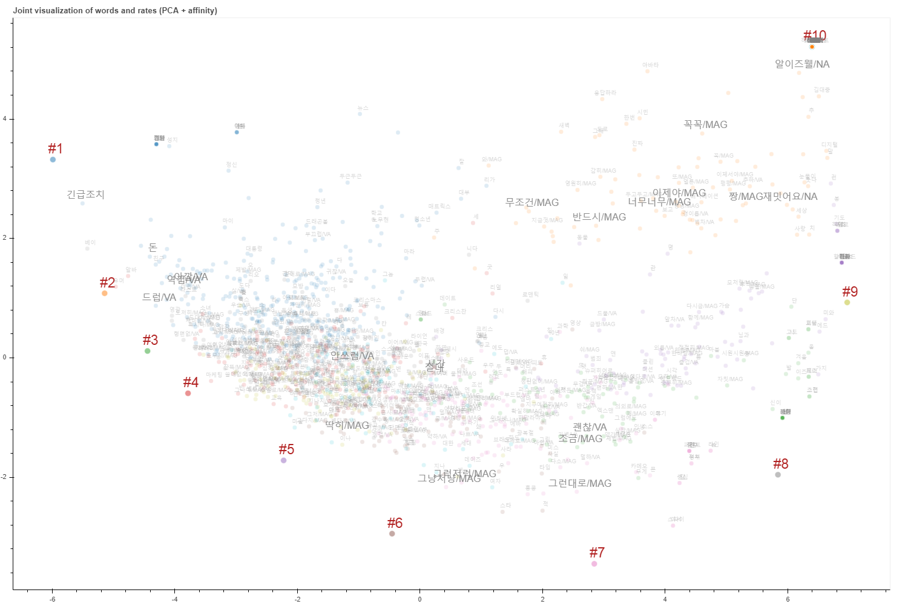

# (Demo) Joint visualization of words and docs

Visualizing representation vector of words and docs trained from Doc2Vec

Doc2Vec 은 단어와 문서를 한 공간에 함께 임베딩 한다고 알려져 있습니다. 사실 이 표현은 절반만 맞습니다. 이 데모에서는 Doc2Vec 에 의하여 학습된 공간을 탐색해 보고, (아마도) 우리가 원하는 문서와 단어가 함께 표현되는 scatter plot 을 그리기 위한 방법을 다뤄봅니다.

Word2Vec 은 단어의 앞, 뒤에 등장하는 문맥 단어 (context words) 의 분포가 유사한 두 단어 w1, w2 가 서로 비슷한 벡터로 표현되도록 softmax regression 을 학습합니다. Doc2Vec 은 임베딩하고 싶은 대상의 아이디를 마치 단어처럼 취급합니다. 대상 (entity) 는 document 뿐 아니라 임의의 label 도 될 수 있습니다.

문서의 아이디를 단어로 정의했으므로, 그 문서의 문맥 단어 역시 정의를 해야 합니다. Doc2Vec 은 한 문서 (혹은 문장 혹은 entity label) 에 등장하는 모든 단어를 context words 로 정의합니다. 이에 대한 자세한 설명은 [이 블로그](https://lovit.github.io/nlp/representation/2018/03/26/word_doc_embedding/)에 적혀있습니다. Doc2Vec 은 단어의 분포가 비슷한 두 문서 d1, d2 를 비슷한 벡터로 학습합니다.

하지만 d1 과 w1 은 문맥 단어의 분포가 매우 다릅니다. w1 의 문맥 단어 분포는 주변에는 문장에서 좌, 우에 등장했던 단어로만 이뤄지는데, d1 의 문맥 단어 분포는 문서의 시작과 끝에 등장하는 모든 단어들로 구성됩니다. 문서의 길이가 길거나, 여러 문서의 레이블을 임베딩 대상 (document id) 로 정의할 경우에는 그 정도가 심해집니다. Word2Vec 은 문맥 단어의 분포가 유사한 두 단어를 비슷한 벡터로 표현하기 때문에 자연스레 문서들과 단어들은 서로 나뉘어져 임베딩 공간에 배치됩니다. 한 공간에 학습되기는 하지만, 경계를 두고 서로 나뉘어져 있습니다. 이런 경우를 같은 공간에 임베딩 되었다고 표현하는 것은 무리가 있습니다.

이는 Word2Vec 에 의하여 학습되는 word representation 은 context space 임에 반하여, doc2vec 에 의하여 학습되는 document representation 은 topic space 이기 때문에 발생하는 문제입니다. 두 종류의 데이터를 바탕으로 실제 예시를 살펴봅니다.

아래의 그림을 만드는 코드는 demo 폴더에 IPython notebook 파일로 저장되어 있으며, 최종 결과는 Bokeh 를 이용하여 demo 폴더에 HTML 로 저장하였습니다. 

## Joint visualization for News and words

아래는 2 만여개의 단어로 구성된 3 만여개의 2016-10-20 의 뉴스 기사를 Doc2Vec 을 이용하여 학습한 뒤, word, document vectors 를 한번에 PCA 로 압축한 그림입니다. 단어와 문서가 2 : 3 의 비율로 섞여 있기 때문에 임베딩 공간 전체를 어느 정도 균등하게 나눠 차지합니다. 하지만 문서와 단어가 뒤섞인 그림의 형태는 아닙니다. 또한 PCA 로 공간이 이처럼 나뉘어졌다는 것은 정말로 문서와 단어가 임베딩 공간을 이분 (bipartite) 하고 있다는 가능성을 시사합니다.

([Bokeh HTML page](https://raw.githubusercontent.com/lovit/joint_visualize_words_docs/master/demo/joint_visualization_word_doc_news_tsne.html))

t-SNE 를 이용하여 그린 그림에서도 이는 확인됩니다. 물론 몇 몇 문서들은 단어와 뒤섞여 있기는 합니다만, 두 공간이 나뉘어져 있을 가능성이 높습니다.

([Bokeh HTML page](https://github.com/lovit/joint_visualize_words_docs/raw/master/demo/joint_visualization_word_doc_news_pca.html))

뉴스와 단어에서는 각각의 객체의 개수가 비슷하기 때문에 공간이 어느 정도 나뉘어졌습니다. 이 경우에는 1500 개의 단어만 선택하여 임베딩하였는데, 선택의 기준 역시 IPython notebook 파일에 구현되어 있습니다.

## Joint visualization for entity and words (extremely imbalanced case)

네이버 영화 평점 데이터를 이용하여 각 영화평의 점수를 document id 로 학습합니다. 점수 벡터만 PCA 를 이용하여 2 차원으로 표현하면 어떤 구조가 보입니다. 이는 점수 벡터는 잘 학습이 되었음을 의미합니다.

그러나 t-SNE 나 PCA 를 이용하여 점수와 단어 벡터를 함께 2 차원으로 표현하면 점수 벡터만 한 곳에 뭉쳐져 있습니다. 이는 점수 벡터 자체가 매우 좁은 공간에 몰려 있기 때문입니다.

게다가 단어가 점수별로 나뉘어져 있는 것도 아닙니다. 아래는 1500 여개의 단어를 2 차원으로 표현한 뒤, 가장 많이 등장했던 점수대별로 색을 칠한 것입니다. 어떤 경향성이 없습니다. 왜냐면 점수는 topical information 이고, 단어의 임베딩 공간은 context space 이기 때문입니다.

아마도 우리가 Doc2Vec 으로 학습 한 결과를 시각화 할 때는 아래와 같은 그림을 예상할 것입니다. 문서와 단어를 함께 표현한다는 것은 이미 topical space 에서의 그림을 그리겠다는 의미입니다. 이 때에는 단어의 임베딩 벡터를 이용하는 것이 아니라, 단어의 topical representation 을 이용해야 합니다. 그리고 이는 document vectors 의 가중 평균, 혹은 임의의 어떤 방법으로도 만들 수 있습니다.

([Bokeh HTML page](https://github.com/lovit/joint_visualize_words_docs/raw/master/demo/joint_visualization_word_doc_movie_pca_affinity.html))

# Requirements
- gensim >= 3.6.0
- scikit-learn >= 0.20.1

